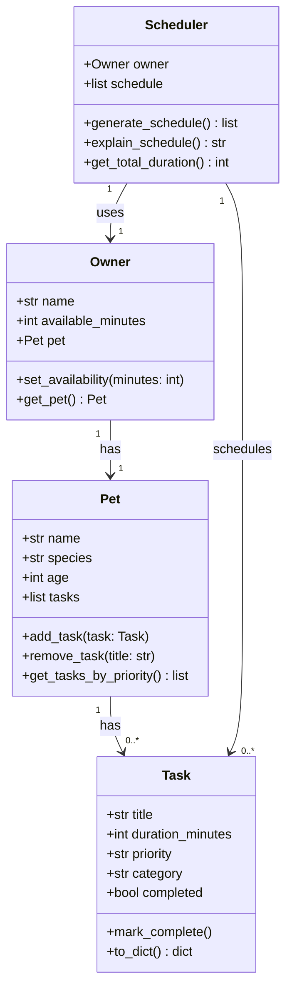
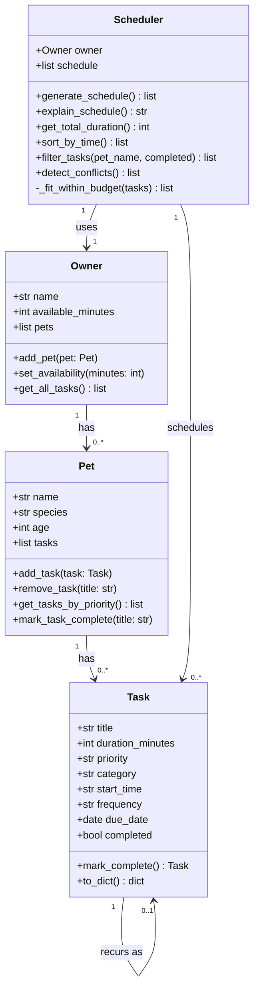

# PawPal+ Project Reflection

## 1. System Design

**a. Initial design**

**Three core user actions:**

1. **Enter owner and pet info** — The user provides basic profile details such as their name, the pet's name, and the pet's type (dog, cat, etc.). This personalizes the app and gives the scheduler context about who it is planning for.

2. **Add and edit care tasks** — The user creates individual pet care tasks (e.g., morning walk, feeding, medication, grooming) and specifies each task's estimated duration and priority level. Users can also edit or remove tasks as their pet's routine changes.

3. **Generate and view a daily schedule** — The user requests a daily care plan. The app uses the task list and any time or priority constraints to produce an ordered schedule, and displays an explanation of why tasks were arranged in that order.

**Initial design — classes and responsibilities:**

The system is built around four classes. `Task` is the smallest unit of data: it represents one care item (such as a walk or a feeding) and holds the information needed to schedule it — its name, how long it takes, its priority level, and whether it has been completed. `Pet` acts as a container for a pet's profile and its list of care tasks; it is responsible for managing that list and can return tasks sorted by priority when the scheduler needs them. `Owner` holds the human side of the equation — the owner's name and, crucially, how many minutes they have available in the day; it also holds a reference to their pet, making it the single entry point for all relevant data. `Scheduler` is the only class with real logic: it takes an `Owner`, reads the pet's tasks, and produces an ordered daily schedule that respects both priority and the owner's time budget; it also generates a plain-English explanation of its decisions.

**Main objects (classes), attributes, and methods:**

| Class | Attributes | Methods |
|---|---|---|
| `Task` | `title`, `duration_minutes`, `priority` ("low"/"medium"/"high"), `category`, `completed` | `mark_complete()`, `to_dict()` |
| `Pet` | `name`, `species`, `age`, `tasks` (list of Task) | `add_task(task)`, `remove_task(title)`, `get_tasks_by_priority()` |
| `Owner` | `name`, `available_minutes`, `pet` (Pet) | `set_availability(minutes)`, `get_pet()` |
| `Scheduler` | `owner` (Owner), `schedule` (ordered list of Task) | `generate_schedule()`, `explain_schedule()`, `get_total_duration()` |

**Relationships:**
- `Owner` has one `Pet`
- `Pet` has many `Task`s
- `Scheduler` takes an `Owner` (and through it, accesses `Pet` and `Task`s)

**UML Class Diagram — Initial (Mermaid.js):**

I am designing a pet care app called PawPal+ with four core classes: `Task`, `Pet`, `Owner`, and `Scheduler`. Together they model a pet owner's daily care routine and the logic that turns a task list into a prioritized daily plan.

**UML Class Diagram — Final (Mermaid.js):**

Updated to reflect all attributes and methods added during implementation.

**b. Design changes**

Reviewing the initial diagram revealed three issues, one missing relationship and two logic bottlenecks:

1. **Missing `Scheduler → Task` relationship (fixed in diagram).** `Scheduler.schedule` is a `list[Task]`, so `Scheduler` directly reads and stores `Task` objects. The original diagram only showed `Scheduler → Owner`, leaving this dependency invisible. Added a `Scheduler "1" --> "0..*" Task : schedules` arrow to make it explicit.

2. **`Task.priority` is an unordered string — sorting bottleneck.** The values `"low"`, `"medium"`, and `"high"` have no natural Python sort order. Without an explicit priority map (`{"high": 0, "medium": 1, "low": 2}`), any sort will silently produce wrong results. Resolved by defining `_PRIORITY_RANK` as a module-level constant used by all sort keys.

3. **`generate_schedule()` risks becoming a logic bottleneck.** A single method doing everything is hard to test. Resolved by extracting `_fit_within_budget()` as a private helper so each concern can be verified independently.

**Additional changes made during implementation:**

4. **`Owner` was redesigned to hold multiple pets.** The initial design had `Owner` with a single `pet: Pet` attribute. Implementation expanded this to `pets: list[Pet]` with an `add_pet()` method and a `get_all_tasks()` method that aggregates and sorts across all pets.

5. **`Task` gained three new fields for smarter scheduling.** `start_time` (HH:MM string), `frequency` ("once"/"daily"/"weekly"), and `due_date` were added to support time-sorted display, recurring task generation, and conflict detection.

6. **`mark_complete()` became a factory method.** Originally a void mutator, it was redesigned to return a new `Task` instance for recurring tasks (or `None` for one-time tasks), which keeps `Task` self-contained and makes the recurrence logic easy to test in isolation.

7. **`Pet.mark_task_complete()` was added.** This method owns the responsibility of completing a task and appending the next occurrence — so `Pet` manages its own list, and callers don't need to handle the returned Task themselves.

8. **`Scheduler` gained three algorithmic methods.** `sort_by_time()`, `filter_tasks()`, and `detect_conflicts()` were all absent from the initial design and emerged as requirements during the implementation phase.

---

## 2. Scheduling Logic and Tradeoffs

**a. Constraints and priorities**

The scheduler considers two constraints: **task priority** and **owner time budget**. Priority is the primary sort key — tasks ranked high, medium, then low are evaluated in that order. The time budget acts as a hard cut-off: once the remaining available minutes cannot fit the next task, it is skipped (even if a later, shorter task could still fit). An optional `start_time` on each task enables time-sorted display and conflict detection, but does not affect which tasks are selected — the selection algorithm is purely priority-and-budget-greedy.

Priority was treated as the most important constraint because the core scenario is a busy owner who cannot do everything — they need to be sure the most critical care (medication, feeding) happens first, even if enrichment tasks get dropped. Time budget is second because it is the hard real-world limit that no algorithm can override.

**b. Tradeoffs**

The conflict detector uses **exact HH:MM string matching** rather than checking whether task durations overlap in time. This means two tasks flagged as conflicting at `"08:00"` might not actually collide — a 5-minute task and a 60-minute task both labelled `"08:00"` genuinely conflict, but two tasks labelled `"08:00"` and `"08:06"` are effectively back-to-back yet undetected as a conflict. Conversely, a 30-minute task at `"08:00"` and a task at `"08:15"` are actually overlapping but go unflagged.

This tradeoff is reasonable for the current scope because most pet care tasks are assigned to a rough time-of-day slot rather than a precise clock time. Exact-match detection catches the most common user error (assigning two tasks the same slot label) without requiring interval arithmetic. A full overlap check — computing `end_time = start_time + duration` and testing for range intersections — is a meaningful but scoped future improvement.

---

## 3. AI Collaboration

**a. How you used AI**

AI was used throughout every phase: brainstorming the initial class structure, generating method stubs from the UML diagram, suggesting edge cases to test, and explaining Python-specific idioms (e.g. using a `lambda` key with `sorted()` for the `"99:99"` sentinel pattern in `sort_by_time()`). The most effective prompts were specific and scoped — for example, "given this `Task` class with a `frequency` field, how should `mark_complete()` return the next occurrence?" — rather than broad requests like "build a pet scheduler." Targeted prompts produced code that was close to correct and needed only minor structural adjustments.

For debugging, asking "why is this test failing — is the bug in my test or my logic?" consistently produced useful diagnoses. For design, asking "what edge cases should I test for a greedy scheduler?" surfaced cases (zero budget, exact-fit tasks, tasks with no start time) that might otherwise have been missed.

**b. Judgment and verification**

When AI generated an initial version of `generate_schedule()`, it placed all scheduling logic — priority sorting, time filtering, and schedule building — inside a single method body. The suggestion worked correctly but was difficult to test: any test failure could come from any of three different concerns, with no way to isolate which one. The method was refactored to extract `_fit_within_budget()` as a private helper so that sorting and selection could be verified independently. This change was not suggested by the AI; it came from recognising that testability is a design goal, not just a runtime goal. The AI's output was verified by running the test suite before and after refactoring and confirming that all 31 tests passed with the new structure.

A second rejection: AI initially suggested using Python's `datetime.strptime` to parse and compare `start_time` strings for conflict detection. This was replaced with direct string comparison (`t.start_time or "99:99"`), which is simpler, has no failure mode from malformed input at the comparison step, and is sufficient for the HH:MM format. The tradeoff was documented in reflection §2b so future maintainers understand the limitation.

---

## 4. Testing and Verification

**a. What you tested**

The test suite covers 31 behaviors across five categories:

- **Task lifecycle** — `mark_complete()` flips status; calling it twice is safe; one-time tasks return `None`; daily/weekly tasks return a correctly-dated next instance that inherits all properties from the original.
- **Pet task management** — `add_task`, `remove_task`, `get_tasks_by_priority`, and `mark_task_complete` (which auto-appends next recurrence). Safe no-ops for non-existent titles are tested explicitly.
- **Scheduler core** — respects time budget; prefers high priority; excludes already-completed tasks from new schedules; task that exactly fills the budget is included (boundary condition).
- **Algorithmic methods** — `sort_by_time()` produces chronological HH:MM order with flexible tasks last; `filter_tasks()` filters by pet, by status, and by both combined; `detect_conflicts()` flags shared slots within and across pets, ignores tasks with no start time, and returns `[]` when no conflicts exist.
- **Data integrity** — `to_dict()` returns all eight expected fields.

These tests are important because the scheduler's correctness is invisible at runtime — wrong priority ordering or a missed conflict doesn't cause a crash, it silently produces a bad schedule. Tests catch the difference.

**b. Confidence**

Confidence level: **★★★★☆ (4/5)**

All implemented behaviors are covered, including boundary conditions and safe no-ops. The remaining gap is the exact-match conflict detection limitation: tasks that overlap in duration but have different start time strings are not flagged. Testing for duration-overlap detection would require interval arithmetic logic that has not yet been implemented. If given more time, the next tests to write would be: tasks with overlapping durations at adjacent start times, a schedule where the budget is exactly zero, and a recurring task completed multiple times in sequence to verify the chain of due dates is correct.

---

## 5. Reflection

**a. What went well**

The separation of concerns between classes worked well in practice. Because `Task.mark_complete()` is responsible for generating the next occurrence and returns it rather than mutating any external list, it was trivially testable: pass in a task, call the method, check the return value. This pattern — methods that return values rather than relying on side effects — made every algorithmic method easy to unit test in isolation, which kept the debugging cycle short throughout the project.

**b. What you would improve**

The conflict detector would be the first thing to redesign. Upgrading from exact-match string comparison to full interval overlap detection (computing `end = start + duration` in minutes and testing for range intersection) would make the warning system genuinely reliable rather than approximate. A second improvement would be adding a `ScheduledSlot` data class that pairs a `Task` with an explicit `start_datetime`, so the display can show real clock times ("08:00 – 08:30") rather than relative elapsed minutes.

**c. Key takeaway**

The most important lesson was that **AI is most useful as a first-draft generator, not a final decision-maker**. Every class, method, and test started from an AI suggestion, but almost none were accepted without reading, questioning, and often restructuring. The moment that crystallized this was the `generate_schedule()` refactor: the AI's version worked, but working and well-designed are different things. Acting as the lead architect meant evaluating AI output not just for correctness but for testability, clarity, and alignment with the system's design goals — a skill that requires understanding the system well enough to know what "good" looks like before the code exists.
