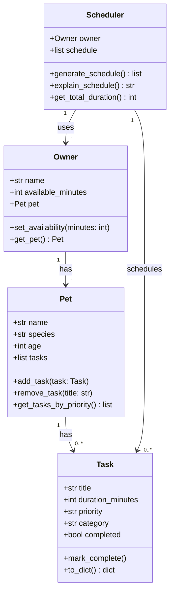

# PawPal+ Project Reflection

## 1. System Design

**a. Initial design**

**Three core user actions:**

1. **Enter owner and pet info** — The user provides basic profile details such as their name, the pet's name, and the pet's type (dog, cat, etc.). This personalizes the app and gives the scheduler context about who it is planning for.

2. **Add and edit care tasks** — The user creates individual pet care tasks (e.g., morning walk, feeding, medication, grooming) and specifies each task's estimated duration and priority level. Users can also edit or remove tasks as their pet's routine changes.

3. **Generate and view a daily schedule** — The user requests a daily care plan. The app uses the task list and any time or priority constraints to produce an ordered schedule, and displays an explanation of why tasks were arranged in that order.

**Initial design — classes and responsibilities:**

The system is built around four classes. `Task` is the smallest unit of data: it represents one care item (such as a walk or a feeding) and holds the information needed to schedule it — its name, how long it takes, its priority level, and whether it has been completed. `Pet` acts as a container for a pet's profile and its list of care tasks; it is responsible for managing that list and can return tasks sorted by priority when the scheduler needs them. `Owner` holds the human side of the equation — the owner's name and, crucially, how many minutes they have available in the day; it also holds a reference to their pet, making it the single entry point for all relevant data. `Scheduler` is the only class with real logic: it takes an `Owner`, reads the pet's tasks, and produces an ordered daily schedule that respects both priority and the owner's time budget; it also generates a plain-English explanation of its decisions.

**Main objects (classes), attributes, and methods:**

| Class | Attributes | Methods |
|---|---|---|
| `Task` | `title`, `duration_minutes`, `priority` ("low"/"medium"/"high"), `category`, `completed` | `mark_complete()`, `to_dict()` |
| `Pet` | `name`, `species`, `age`, `tasks` (list of Task) | `add_task(task)`, `remove_task(title)`, `get_tasks_by_priority()` |
| `Owner` | `name`, `available_minutes`, `pet` (Pet) | `set_availability(minutes)`, `get_pet()` |
| `Scheduler` | `owner` (Owner), `schedule` (ordered list of Task) | `generate_schedule()`, `explain_schedule()`, `get_total_duration()` |

**Relationships:**
- `Owner` has one `Pet`
- `Pet` has many `Task`s
- `Scheduler` takes an `Owner` (and through it, accesses `Pet` and `Task`s)

**UML Class Diagram (Mermaid.js):**

I am designing a pet care app called PawPal+ with four core classes: `Task`, `Pet`, `Owner`, and `Scheduler`. Together they model a pet owner's daily care routine and the logic that turns a task list into a prioritized daily plan.

**Design review notes:**
- `Owner → Pet` is a one-to-one relationship (simple scope for this app).
- `Pet → Task` is one-to-many — a pet can have any number of care tasks.
- `Scheduler → Owner` is a uses/dependency relationship; it does not own the Owner, it reads from it.
- No unnecessary intermediate classes (e.g., no `TaskList` wrapper — `Pet.tasks` is sufficient).
- `category` on `Task` is kept as a plain string to avoid over-engineering an enum for now.

- Briefly describe your initial UML design.
- What classes did you include, and what responsibilities did you assign to each?

**b. Design changes**

Reviewing the initial diagram revealed three issues, one missing relationship and two logic bottlenecks:

1. **Missing `Scheduler → Task` relationship (fixed in diagram).** `Scheduler.schedule` is a `list[Task]`, so `Scheduler` directly reads and stores `Task` objects. The original diagram only showed `Scheduler → Owner`, leaving this dependency invisible. Added a `Scheduler "1" --> "0..*" Task : schedules` arrow to make it explicit.

2. **`Task.priority` is an unordered string — sorting bottleneck.** The values `"low"`, `"medium"`, and `"high"` have no natural Python sort order. Without an explicit priority map (e.g. `{"high": 0, "medium": 1, "low": 2}`), any sort will silently produce wrong results (alphabetical order puts `"high"` before `"low"` before `"medium"`). This needs to be handled carefully inside `Scheduler.generate_schedule()` or `Pet.get_tasks_by_priority()`.

3. **`generate_schedule()` risks becoming a logic bottleneck.** A single method that reads tasks, filters by time budget, sorts by priority, and builds the schedule is hard to test and debug in isolation. Plan to split it into private helpers (e.g. `_sort_tasks()`, `_fit_within_budget()`) so each concern can be verified independently.

---

## 2. Scheduling Logic and Tradeoffs

**a. Constraints and priorities**

- What constraints does your scheduler consider (for example: time, priority, preferences)?
- How did you decide which constraints mattered most?

**b. Tradeoffs**

The conflict detector uses **exact HH:MM string matching** rather than checking whether task durations overlap in time. This means two tasks flagged as conflicting at `"08:00"` might not actually collide in practice — for example, a 5-minute task starting at 08:00 and a 60-minute task also starting at 08:00 genuinely overlap, but a future task scheduled for 08:00 that completes by 08:05 and another starting at 08:06 would be a false alarm if both carried the label `"08:00"`. Conversely, a task at `"08:00"` lasting 30 minutes and a task at `"08:15"` are actually overlapping but would go completely undetected.

This tradeoff is reasonable for the current scope because: most pet care tasks are assigned to a rough time of day (morning, evening) rather than a precise clock time, so exact-match detection catches the most common mistake (assigning two tasks the same slot label) without requiring the added complexity of interval arithmetic. A full overlap check would require tracking both a `start_time` and an `end_time` or computing end = start + duration, which is a meaningful addition that can be added in a future iteration.

---

## 3. AI Collaboration

**a. How you used AI**

- How did you use AI tools during this project (for example: design brainstorming, debugging, refactoring)?
- What kinds of prompts or questions were most helpful?

**b. Judgment and verification**

- Describe one moment where you did not accept an AI suggestion as-is.
- How did you evaluate or verify what the AI suggested?

---

## 4. Testing and Verification

**a. What you tested**

- What behaviors did you test?
- Why were these tests important?

**b. Confidence**

- How confident are you that your scheduler works correctly?
- What edge cases would you test next if you had more time?

---

## 5. Reflection

**a. What went well**

- What part of this project are you most satisfied with?

**b. What you would improve**

- If you had another iteration, what would you improve or redesign?

**c. Key takeaway**

- What is one important thing you learned about designing systems or working with AI on this project?
